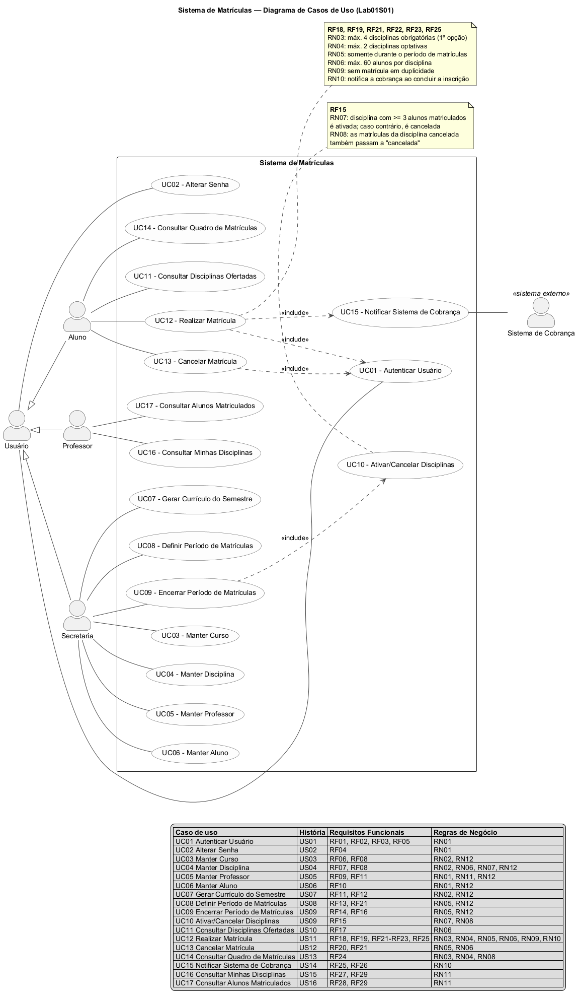
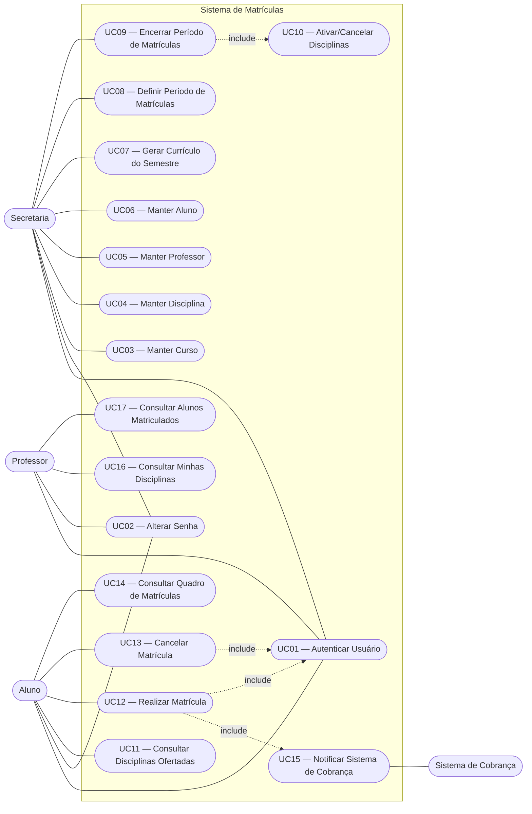

# Sistema de Matrículas — PUC Minas

**Laboratório de Desenvolvimento de Software — Laboratório 2 (2º Semestre/2026)**
Curso de Engenharia de Software — Prof. Glender Brás

Sistema para informatizar o processo de matrículas de uma universidade, permitindo que a
secretaria gere o currículo semestral, que os alunos se matriculem (e cancelem matrículas)
em disciplinas durante o período de matrícula, e que os professores consultem os alunos
inscritos em suas disciplinas. Ao final do período de matrículas o sistema define quais
disciplinas serão efetivamente ofertadas e notifica o sistema de cobrança.

---

## Sumário

- [1. Visão Geral do Sistema](#1-visão-geral-do-sistema)
- [2. Atores do Sistema](#2-atores-do-sistema)
- [3. Requisitos Funcionais](#3-requisitos-funcionais)
- [4. Requisitos Não Funcionais](#4-requisitos-não-funcionais)
- [5. Regras de Negócio](#5-regras-de-negócio)
- [6. Diagrama de Casos de Uso](#6-diagrama-de-casos-de-uso)
- [7. Casos de Uso — Visão Geral](#7-casos-de-uso--visão-geral)
- [8. Histórias de Usuário — Detalhamento dos Casos de Uso](#8-histórias-de-usuário--detalhamento-dos-casos-de-uso)
- [9. Rastreabilidade e Backlog do Produto](#9-rastreabilidade-e-backlog-do-produto)
- [10. Estrutura do Repositório](#10-estrutura-do-repositório)
- [11. Cronograma das Sprints](#11-cronograma-das-sprints)
- [12. Equipe](#12-equipe)

---

## 1. Visão Geral do Sistema

A universidade deseja informatizar seu sistema de matrículas. A secretaria gera o currículo
de cada semestre e mantém as informações sobre cursos, disciplinas, professores e alunos.

Cada **curso** possui um nome, um número de créditos e é constituído por diversas
**disciplinas**. Durante o **período de matrículas**, o aluno acessa o sistema para se
matricular em **4 disciplinas obrigatórias (1ª opção)** e em até **2 disciplinas optativas
(alternativas)**, podendo também cancelar matrículas já efetuadas.

Uma disciplina só é ativada (isto é, só será ofertada no semestre seguinte) se, ao final do
período de matrículas, tiver no mínimo **3 alunos matriculados**; caso contrário ela é
cancelada. O número máximo de alunos por disciplina é **60**, e ao atingir esse limite as
matrículas para aquela disciplina são encerradas.

Após o aluno concluir sua inscrição no semestre, o **sistema de cobrança** é notificado pelo
sistema de matrículas, de modo que o aluno possa ser cobrado pelas disciplinas cursadas.
Todos os usuários possuem senha, utilizada para validação do respectivo login.

### Escopo

| Dentro do escopo | Fora do escopo |
|---|---|
| Autenticação de alunos, professores e secretaria | Emissão e processamento de boletos (responsabilidade do sistema de cobrança) |
| Manutenção de cursos, disciplinas, professores e alunos | Lançamento de notas e frequência |
| Geração do currículo semestral | Histórico escolar e coeficiente de rendimento |
| Abertura e encerramento do período de matrículas | Alocação de salas e horários |
| Matrícula e cancelamento de matrícula em disciplinas | Portal de pagamento / módulo financeiro |
| Ativação/cancelamento automático de disciplinas | Integração com sistemas acadêmicos externos |
| Consulta de alunos matriculados por disciplina | |
| Notificação ao sistema de cobrança | |

---

## 2. Atores do Sistema

| Ator | Tipo | Descrição |
|---|---|---|
| **Usuário** | Ator generalizado | Abstração de todo usuário autenticável do sistema (aluno, professor e secretaria). Possui login e senha. |
| **Aluno** | Primário | Realiza e cancela matrículas em disciplinas durante o período de matrículas e consulta seu quadro de matrículas. |
| **Professor** | Primário | Consulta as disciplinas que leciona e a lista de alunos matriculados em cada uma delas. |
| **Secretaria** | Primário | Mantém cursos, disciplinas, professores e alunos; gera o currículo do semestre; abre e encerra o período de matrículas. |
| **Sistema de Cobrança** | Secundário (externo) | Sistema externo que recebe a notificação de matrícula do aluno para efetuar a cobrança das disciplinas do semestre. |

---

## 3. Requisitos Funcionais

> Cada requisito funcional descreve uma **ação realizada por um ator** do sistema.
> Comportamentos internos ("o sistema valida...", "o sistema registra...") estão descritos
> na [Seção 4 — Requisitos Não Funcionais](#4-requisitos-não-funcionais) e as restrições
> aplicáveis a cada ação, na [Seção 5 — Regras de Negócio](#5-regras-de-negócio).

### 3.1 Acesso ao Sistema

| ID | Requisito | Ator | Prioridade |
|---|---|---|---|
| **RF01** | O aluno realiza login no sistema informando sua matrícula e sua senha. | Aluno | Alta |
| **RF02** | O professor realiza login no sistema informando seu código e sua senha. | Professor | Alta |
| **RF03** | A secretaria realiza login no sistema informando seu usuário e sua senha. | Secretaria | Alta |
| **RF04** | O aluno, o professor e a secretaria alteram a própria senha de acesso. | Aluno, Professor, Secretaria | Média |
| **RF05** | O aluno, o professor e a secretaria encerram a própria sessão (logout). | Aluno, Professor, Secretaria | Baixa |

### 3.2 Manutenção de Cadastros (Secretaria)

| ID | Requisito | Ator | Prioridade |
|---|---|---|---|
| **RF06** | A secretaria cadastra, consulta, altera e remove **cursos**, informando nome e número de créditos. | Secretaria | Alta |
| **RF07** | A secretaria cadastra, consulta, altera e remove **disciplinas**, informando código, nome, número de créditos e tipo (obrigatória ou optativa). | Secretaria | Alta |
| **RF08** | A secretaria associa disciplinas a um curso. | Secretaria | Alta |
| **RF09** | A secretaria cadastra, consulta, altera e remove **professores**, definindo suas credenciais de acesso. | Secretaria | Alta |
| **RF10** | A secretaria cadastra, consulta, altera e remove **alunos**, vinculando-os a um curso e definindo suas credenciais de acesso. | Secretaria | Alta |
| **RF11** | A secretaria associa um professor responsável a cada disciplina do currículo. | Secretaria | Alta |

### 3.3 Currículo e Período de Matrículas (Secretaria)

| ID | Requisito | Ator | Prioridade |
|---|---|---|---|
| **RF12** | A secretaria gera o **currículo do semestre**, selecionando as disciplinas ofertadas em cada curso. | Secretaria | Alta |
| **RF13** | A secretaria define a data de início e a data de fim do **período de matrículas** de um semestre. | Secretaria | Alta |
| **RF14** | A secretaria encerra o período de matrículas do semestre. | Secretaria | Alta |
| **RF15** | A secretaria ativa as disciplinas que alcançaram pelo menos 3 alunos matriculados e cancela as demais ao encerrar o período de matrículas. | Secretaria | Alta |
| **RF16** | A secretaria consulta o resultado do encerramento do período, com as disciplinas ativadas, as canceladas e a quantidade de matriculados de cada uma. | Secretaria | Média |

### 3.4 Matrícula (Aluno)

| ID | Requisito | Ator | Prioridade |
|---|---|---|---|
| **RF17** | O aluno consulta as disciplinas ofertadas no currículo do semestre e as vagas disponíveis em cada uma. | Aluno | Alta |
| **RF18** | O aluno se matricula em até **4 disciplinas obrigatórias (1ª opção)** por semestre. | Aluno | Alta |
| **RF19** | O aluno se matricula em até **2 disciplinas optativas (alternativas)** por semestre. | Aluno | Alta |
| **RF20** | O aluno cancela matrículas realizadas anteriormente. | Aluno | Alta |
| **RF21** | O aluno realiza e cancela matrículas somente durante o período de matrículas. | Aluno | Alta |
| **RF22** | O aluno se matricula em uma disciplina somente enquanto ela tiver menos de 60 alunos matriculados. | Aluno | Alta |
| **RF23** | O aluno se matricula uma única vez em cada disciplina do semestre. | Aluno | Alta |
| **RF24** | O aluno consulta seu quadro de matrículas do semestre, com o tipo (obrigatória/optativa) e a situação de cada disciplina. | Aluno | Média |

### 3.5 Cobrança

| ID | Requisito | Ator | Prioridade |
|---|---|---|---|
| **RF25** | O sistema de cobrança recebe a notificação com a identificação do aluno, o semestre e as disciplinas matriculadas assim que o aluno conclui sua inscrição no semestre. | Sistema de Cobrança | Alta |
| **RF26** | A secretaria consulta o histórico das notificações enviadas ao sistema de cobrança. | Secretaria | Baixa |

### 3.6 Consultas (Professor)

| ID | Requisito | Ator | Prioridade |
|---|---|---|---|
| **RF27** | O professor consulta as disciplinas sob sua responsabilidade no semestre corrente. | Professor | Alta |
| **RF28** | O professor consulta os alunos matriculados em cada uma de suas disciplinas. | Professor | Alta |
| **RF29** | O professor consulta a situação da disciplina (ativa, cancelada ou aguardando encerramento do período) e o total de matriculados. | Professor | Média |

## 4. Requisitos Não Funcionais

| ID | Categoria | Requisito |
|---|---|---|
| **RNF01** | Tecnologia | O sistema deve ser desenvolvido na linguagem **Java** (JDK 17 ou superior). |
| **RNF02** | Interface | A interface do protótipo será em **linha de comando (CLI)**, com menus textuais organizados por perfil de usuário. |
| **RNF03** | Persistência | Os dados devem ser persistidos em **arquivos**, garantindo que as informações permaneçam disponíveis entre execuções do sistema. |
| **RNF04** | Segurança | As senhas dos usuários não devem ser armazenadas em texto puro; deve ser armazenado o *hash* da senha. |
| **RNF05** | Segurança | O sistema deve validar as credenciais informadas no login e negar o acesso quando o identificador ou a senha forem inválidos, exibindo mensagem genérica que não revele qual dos dois está incorreto. |
| **RNF06** | Segurança | O sistema deve restringir o acesso a cada funcionalidade ao perfil autorizado, apresentando ao usuário autenticado apenas o menu correspondente ao seu perfil (aluno, professor ou secretaria). |
| **RNF07** | Usabilidade | As mensagens de erro devem ser claras e indicar o motivo da recusa da operação (ex.: "disciplina lotada", "fora do período de matrículas"). |
| **RNF08** | Desempenho | Operações de consulta e matrícula devem ser concluídas em até 2 segundos em uma base com até 1.000 alunos e 100 disciplinas. |
| **RNF09** | Confiabilidade | A operação de matrícula deve ser atômica: em caso de falha, nenhuma alteração parcial deve ser gravada. |
| **RNF10** | Auditoria | O sistema deve registrar as notificações enviadas ao sistema de cobrança (data/hora, aluno, semestre, disciplinas e situação do envio), mantendo-as disponíveis para consulta pela secretaria. |
| **RNF11** | Manutenibilidade | O código deve ser organizado em camadas (modelo, persistência, serviço/regras de negócio e interface), com nomenclatura padronizada. |
| **RNF12** | Portabilidade | O sistema deve executar em qualquer sistema operacional com JVM instalada (Windows, Linux e macOS). |
| **RNF13** | Rastreabilidade | O repositório GitHub deve conter todas as versões dos modelos UML produzidos e o código-fonte final. |
| **RNF14** | Integração | A notificação ao sistema de cobrança deve ser feita por uma interface bem definida, permitindo substituir a implementação sem impacto nas regras de matrícula. |
| **RNF15** | Documentação | O sistema deve ser documentado por diagramas UML (casos de uso, classes e arquitetura), mantidos atualizados a cada sprint. |

---

## 5. Regras de Negócio

| ID | Regra |
|---|---|
| **RN01** | Todo usuário do sistema possui login e senha, obrigatórios para acessar qualquer funcionalidade. |
| **RN02** | Um curso possui nome, número de créditos e é constituído por diversas disciplinas. |
| **RN03** | O aluno pode se matricular em, no máximo, **4 disciplinas obrigatórias (1ª opção)** por semestre. |
| **RN04** | O aluno pode se matricular em, no máximo, **2 disciplinas optativas (alternativas)** por semestre. |
| **RN05** | Matrículas e cancelamentos só podem ser realizados **dentro do período de matrículas** definido pela secretaria. |
| **RN06** | Uma disciplina comporta no máximo **60 alunos matriculados**; atingido esse número, as matrículas para ela são encerradas automaticamente. |
| **RN07** | Ao final do período de matrículas, a disciplina com **pelo menos 3 alunos matriculados** é **ativada**; caso contrário, é **cancelada**. |
| **RN08** | Quando uma disciplina é cancelada, as matrículas dos alunos naquela disciplina passam à situação "cancelada". |
| **RN09** | O aluno não pode se matricular duas vezes na mesma disciplina no mesmo semestre. |
| **RN10** | Após a conclusão da inscrição do aluno no semestre, o sistema de cobrança deve ser notificado. |
| **RN11** | O professor só pode consultar os alunos das disciplinas sob sua responsabilidade. |
| **RN12** | Apenas a secretaria pode manter cadastros, gerar o currículo e abrir/encerrar o período de matrículas. |

---

## 6. Diagrama de Casos de Uso



> **Arquivo-fonte (PlantUML):** [`docs/diagramas/casos-de-uso.puml`](docs/diagramas/casos-de-uso.puml) ·
> **Imagem gerada:** [PNG](docs/diagramas/casos-de-uso.png) · [SVG](docs/diagramas/casos-de-uso.svg)

<details>
<summary>Versão equivalente em Mermaid (renderizada pelo próprio GitHub)</summary>



</details>

**Relacionamentos representados**

| Origem | Relação | Destino | Significado |
|---|---|---|---|
| UC12 — Realizar Matrícula | `<<include>>` | UC01 — Autenticar Usuário | A matrícula só ocorre com o aluno autenticado. |
| UC13 — Cancelar Matrícula | `<<include>>` | UC01 — Autenticar Usuário | O cancelamento só ocorre com o aluno autenticado. |
| UC12 — Realizar Matrícula | `<<include>>` | UC15 — Notificar Sistema de Cobrança | Concluída a inscrição no semestre, a cobrança é notificada (RN10). |
| UC09 — Encerrar Período | `<<include>>` | UC10 — Ativar/Cancelar Disciplinas | O encerramento dispara a avaliação do mínimo de 3 alunos (RN07). |
| Aluno / Professor / Secretaria | generalização | Usuário | Todos os atores humanos são usuários autenticáveis (RN01). |

---

## 7. Casos de Uso — Visão Geral

Cada caso de uso do diagrama é **detalhado por uma história de usuário** na
[Seção 8](#8-histórias-de-usuário--detalhamento-dos-casos-de-uso), onde constam pré-condições,
pós-condições, fluxo principal, fluxos alternativos/de exceção e critérios de aceitação.

> Os casos de uso rastreiam apenas **requisitos funcionais** (RF) e as **regras de negócio**
> (RN) que restringem cada ação. Os requisitos não funcionais da
> [Seção 4](#4-requisitos-não-funcionais) são atributos de qualidade do sistema como um todo
> e, por isso, não aparecem no detalhamento dos casos de uso.

| Caso de Uso | Ator principal | História que o detalha | Requisitos |
|---|---|---|---|
| UC01 — Autenticar Usuário | Aluno, Professor, Secretaria | [US01](#us01--realizar-login-no-sistema) | RF01, RF02, RF03 |
| UC02 — Alterar Senha | Aluno, Professor, Secretaria | [US02](#us02--alterar-a-própria-senha) | RF04 |
| UC03 — Manter Curso | Secretaria | [US03](#us03--manter-cursos) | RF06, RF08 |
| UC04 — Manter Disciplina | Secretaria | [US04](#us04--manter-disciplinas) | RF07, RF08 |
| UC05 — Manter Professor | Secretaria | [US05](#us05--manter-professores) | RF09, RF11 |
| UC06 — Manter Aluno | Secretaria | [US06](#us06--manter-alunos) | RF10 |
| UC07 — Gerar Currículo do Semestre | Secretaria | [US07](#us07--gerar-o-currículo-do-semestre) | RF11, RF12 |
| UC08 — Definir Período de Matrículas | Secretaria | [US08](#us08--definir-o-período-de-matrículas) | RF13 |
| UC09 — Encerrar Período de Matrículas | Secretaria | [US09](#us09--encerrar-o-período-de-matrículas-e-definir-as-disciplinas-ativas) | RF14, RF16 |
| UC10 — Ativar/Cancelar Disciplinas | Secretaria *(include de UC09)* | [US09](#us09--encerrar-o-período-de-matrículas-e-definir-as-disciplinas-ativas) | RF15 |
| UC11 — Consultar Disciplinas Ofertadas | Aluno | [US10](#us10--consultar-as-disciplinas-ofertadas) | RF17 |
| UC12 — Realizar Matrícula | Aluno | [US11](#us11--realizar-matrícula-em-disciplinas) | RF18–RF23 |
| UC13 — Cancelar Matrícula | Aluno | [US12](#us12--cancelar-uma-matrícula) | RF20, RF21 |
| UC14 — Consultar Quadro de Matrículas | Aluno | [US13](#us13--consultar-o-quadro-de-matrículas) | RF24 |
| UC15 — Notificar Sistema de Cobrança | Sistema de Cobrança *(include de UC12)* | [US14](#us14--notificar-o-sistema-de-cobrança) | RF25, RF26 |
| UC16 — Consultar Minhas Disciplinas | Professor | [US15](#us15--consultar-minhas-disciplinas) | RF27, RF29 |
| UC17 — Consultar Alunos Matriculados | Professor | [US16](#us16--consultar-os-alunos-matriculados) | RF28 |

**Legenda dos fluxos:** `FP` = fluxo principal · `FA` = fluxo alternativo · `FE` = fluxo de exceção.

---

## 8. Histórias de Usuário — Detalhamento dos Casos de Uso

### Épico 1 — Acesso ao Sistema

#### US01 — Realizar login no sistema

**Detalha:** UC01 — Autenticar Usuário · **Ator:** Aluno, Professor, Secretaria · **Prioridade:** Alta

> **Como** usuário do sistema (aluno, professor ou secretaria),
> **eu quero** acessar o sistema informando meu login e minha senha,
> **para que** somente pessoas autorizadas utilizem as funcionalidades do sistema.

- **Pré-condição:** o usuário está previamente cadastrado pela secretaria e possui credenciais.
- **Pós-condição:** sessão aberta com o perfil do usuário identificado e menu correspondente exibido.

**Fluxo principal (FP)**
1. O sistema apresenta a tela de login.
2. O usuário informa o identificador (matrícula, código do professor ou usuário da secretaria) e a senha.
3. O sistema valida as credenciais informadas.
4. O sistema identifica o perfil do usuário (Aluno, Professor ou Secretaria).
5. O sistema abre a sessão e exibe o menu correspondente ao perfil.

**Fluxos alternativos e de exceção**
- **FE1 — Credenciais inválidas (passo 3):** o sistema exibe "Login ou senha inválidos" e retorna ao passo 1.
- **FA1 — Logout:** a qualquer momento o usuário pode encerrar a sessão e retornar ao passo 1.

**Critérios de aceitação**
- Dado que informo login e senha válidos, quando confirmo o acesso, então sou direcionado ao menu do meu perfil.
- Dado que informo uma senha incorreta, quando confirmo o acesso, então recebo "Login ou senha inválidos" e permaneço na tela de login.
- Dado que não estou autenticado, quando tento acessar qualquer funcionalidade, então o acesso é negado.

**Rastreabilidade:** RF01, RF02, RF03, RF05 · RN01

---

#### US02 — Alterar a própria senha

**Detalha:** UC02 — Alterar Senha · **Ator:** Aluno, Professor, Secretaria · **Prioridade:** Média

> **Como** usuário do sistema,
> **eu quero** alterar minha senha,
> **para que** eu mantenha minha conta segura.

- **Pré-condição:** usuário autenticado (UC01).
- **Pós-condição:** hash da nova senha gravado; a senha anterior deixa de ser válida.

**Fluxo principal (FP)**
1. O usuário seleciona "Alterar senha" no menu.
2. O usuário informa a senha atual e a nova senha (com confirmação).
3. O sistema valida a senha atual informada.
4. O sistema grava o hash da nova senha e confirma a operação.

**Fluxos alternativos e de exceção**
- **FE1 — Senha atual incorreta (passo 3):** o sistema recusa a alteração e informa o erro.
- **FE2 — Confirmação divergente (passo 3):** o sistema solicita novamente a nova senha.

**Critérios de aceitação**
- Dado que estou autenticado, quando informo a senha atual correta e a nova senha, então a senha é atualizada.
- Dado que informo a senha atual incorreta, quando confirmo, então a alteração é recusada.

**Rastreabilidade:** RF04 · RN01

---

### Épico 2 — Manutenção de Cadastros

#### US03 — Manter cursos

**Detalha:** UC03 — Manter Curso · **Ator:** Secretaria · **Prioridade:** Alta

> **Como** secretaria,
> **eu quero** cadastrar, consultar, alterar e remover cursos com nome e número de créditos,
> **para que** eu possa organizar as disciplinas oferecidas pela universidade.

- **Pré-condição:** secretaria autenticada.
- **Pós-condição:** cadastro de cursos atualizado e persistido em arquivo.

**Fluxo principal (FP)**
1. A secretaria seleciona "Manter cursos".
2. O sistema exibe a lista de cursos (código, nome, créditos, nº de disciplinas).
3. A secretaria escolhe a operação: incluir, alterar, consultar ou remover.
4. A secretaria informa/edita nome e número de créditos.
5. O sistema valida os dados, grava e confirma a operação.

**Fluxos alternativos e de exceção**
- **FE1 — Código duplicado (passo 5):** o sistema recusa a inclusão e informa que o curso já existe.
- **FE2 — Remoção de curso com disciplinas associadas (passo 5):** o sistema alerta sobre a dependência e não remove.
- **FA1 — Cancelamento:** a secretaria cancela a operação e retorna ao passo 2 sem alterações.

**Critérios de aceitação**
- Dado que informo nome e número de créditos, quando salvo, então o curso é criado e persistido.
- Dado que um curso já possui disciplinas associadas, quando tento removê-lo, então o sistema alerta sobre a dependência.
- A listagem exibe nome, créditos e a quantidade de disciplinas do curso.

**Rastreabilidade:** RF06, RF08 · RN02, RN12

---

#### US04 — Manter disciplinas

**Detalha:** UC04 — Manter Disciplina · **Ator:** Secretaria · **Prioridade:** Alta

> **Como** secretaria,
> **eu quero** cadastrar, consultar, alterar e remover disciplinas com código, nome, créditos e tipo (obrigatória ou optativa),
> **para que** elas possam compor o currículo dos cursos.

- **Pré-condição:** secretaria autenticada e ao menos um curso cadastrado.
- **Pós-condição:** disciplina persistida e vinculada a um curso, com capacidade máxima de 60 alunos.

**Fluxo principal (FP)**
1. A secretaria seleciona "Manter disciplinas".
2. O sistema exibe a lista de disciplinas cadastradas.
3. A secretaria escolhe a operação: incluir, alterar, consultar ou remover.
4. A secretaria informa código, nome, créditos, tipo (obrigatória/optativa) e o curso ao qual a disciplina pertence.
5. O sistema valida os dados, aplica os limites padrão (mínimo 3 / máximo 60 alunos), grava e confirma.

**Fluxos alternativos e de exceção**
- **FE1 — Código já existente (passo 5):** o sistema recusa a inclusão.
- **FE2 — Disciplina com matrículas ativas (passo 5):** o sistema não permite a remoção.
- **FE3 — Curso inexistente (passo 4):** o sistema solicita um curso válido.

**Critérios de aceitação**
- Dado que informo os dados da disciplina, quando salvo, então ela é persistida e vinculada a um curso.
- Dado que informo um código já existente, quando salvo, então o sistema recusa a operação.
- Toda disciplina nasce com capacidade máxima de 60 alunos e mínimo de 3 para ativação.

**Rastreabilidade:** RF07, RF08 · RN02, RN06, RN07, RN12

---

#### US05 — Manter professores

**Detalha:** UC05 — Manter Professor · **Ator:** Secretaria · **Prioridade:** Alta

> **Como** secretaria,
> **eu quero** cadastrar, consultar, alterar e remover professores e associá-los às disciplinas,
> **para que** cada disciplina tenha um responsável e o professor possa acessar o sistema.

- **Pré-condição:** secretaria autenticada.
- **Pós-condição:** professor cadastrado com credenciais de acesso e, quando aplicável, associado a disciplinas.

**Fluxo principal (FP)**
1. A secretaria seleciona "Manter professores".
2. O sistema exibe a lista de professores.
3. A secretaria escolhe a operação: incluir, alterar, consultar ou remover.
4. A secretaria informa código, nome, e-mail e a senha inicial de acesso.
5. A secretaria associa o professor às disciplinas sob sua responsabilidade.
6. O sistema valida, grava e confirma a operação.

**Fluxos alternativos e de exceção**
- **FE1 — Código de professor já cadastrado (passo 6):** o sistema recusa a inclusão.
- **FE2 — Remoção de professor responsável por disciplina do currículo vigente (passo 6):** o sistema alerta e exige a substituição do responsável antes da remoção.

**Critérios de aceitação**
- Dado que cadastro um professor, quando salvo, então ele recebe login e senha e pode ser associado a disciplinas.
- Dado que informo um código já existente, quando salvo, então o sistema recusa o cadastro.
- Dado que um professor é responsável por disciplinas do semestre, quando tento removê-lo, então o sistema exige a substituição.

**Rastreabilidade:** RF09, RF11 · RN01, RN11, RN12

---

#### US06 — Manter alunos

**Detalha:** UC06 — Manter Aluno · **Ator:** Secretaria · **Prioridade:** Alta

> **Como** secretaria,
> **eu quero** cadastrar, consultar, alterar e remover alunos, vinculando-os a um curso e gerando suas credenciais,
> **para que** eles possam se matricular nas disciplinas do semestre.

- **Pré-condição:** secretaria autenticada e curso cadastrado.
- **Pós-condição:** aluno persistido, vinculado a um curso e apto a fazer login.

**Fluxo principal (FP)**
1. A secretaria seleciona "Manter alunos".
2. O sistema exibe a lista de alunos.
3. A secretaria escolhe a operação: incluir, alterar, consultar ou remover.
4. A secretaria informa matrícula, nome, e-mail, curso e a senha inicial de acesso.
5. O sistema valida, grava e confirma a operação.

**Fluxos alternativos e de exceção**
- **FE1 — Matrícula já cadastrada (passo 5):** o sistema recusa a inclusão.
- **FE2 — Aluno com matrículas ativas no semestre (passo 5):** o sistema alerta antes de remover e cancela as matrículas vinculadas, liberando as vagas.

**Critérios de aceitação**
- Dado que cadastro um aluno, quando salvo, então ele é vinculado a um curso e recebe login e senha.
- Dado que informo uma matrícula já existente, quando salvo, então o sistema recusa o cadastro.
- Dado que removo um aluno com matrículas ativas, então as vagas correspondentes são liberadas.

**Rastreabilidade:** RF10 · RN01, RN12

---

### Épico 3 — Currículo e Período de Matrículas

#### US07 — Gerar o currículo do semestre

**Detalha:** UC07 — Gerar Currículo do Semestre · **Ator:** Secretaria · **Prioridade:** Alta

> **Como** secretaria,
> **eu quero** gerar o currículo de cada semestre definindo as disciplinas ofertadas e seus professores,
> **para que** os alunos saibam em quais disciplinas podem se matricular.

- **Pré-condição:** cursos, disciplinas e professores cadastrados; secretaria autenticada.
- **Pós-condição:** currículo do semestre persistido, com as disciplinas ofertadas e seus professores responsáveis.

**Fluxo principal (FP)**
1. A secretaria seleciona "Gerar currículo do semestre".
2. A secretaria informa o semestre (ex.: 2026/2) e seleciona o curso.
3. O sistema exibe as disciplinas disponíveis do curso.
4. A secretaria seleciona as disciplinas que serão ofertadas no semestre.
5. A secretaria associa o professor responsável a cada disciplina selecionada.
6. O sistema grava o currículo com todas as disciplinas na situação "aguardando encerramento do período".

**Fluxos alternativos e de exceção**
- **FA1 — Currículo já existente (passo 2):** o sistema informa que o currículo do semestre já foi gerado e oferece a opção de editá-lo.
- **FE1 — Disciplina sem professor responsável (passo 6):** o sistema não conclui a geração e indica as disciplinas pendentes.
- **FE2 — Currículo com período de matrículas já aberto (passo 6):** o sistema impede a exclusão de disciplinas que já possuam matriculados.

**Critérios de aceitação**
- Dado que seleciono um semestre e um curso, quando escolho as disciplinas e salvo, então o currículo do semestre é criado.
- Cada disciplina do currículo possui um professor responsável associado.
- Dado que o currículo do semestre já existe, quando tento gerá-lo novamente, então o sistema oferece a opção de editá-lo.

**Rastreabilidade:** RF11, RF12 · RN02, RN12

---

#### US08 — Definir o período de matrículas

**Detalha:** UC08 — Definir Período de Matrículas · **Ator:** Secretaria · **Prioridade:** Alta

> **Como** secretaria,
> **eu quero** definir as datas de início e fim do período de matrículas,
> **para que** os alunos só possam se matricular dentro do prazo estabelecido.

- **Pré-condição:** currículo do semestre gerado; secretaria autenticada.
- **Pós-condição:** período registrado; matrículas e cancelamentos liberados entre as datas definidas.

**Fluxo principal (FP)**
1. A secretaria seleciona "Definir período de matrículas".
2. A secretaria informa o semestre, a data de início e a data de fim.
3. O sistema valida as datas.
4. O sistema registra o período e o marca como aberto a partir da data de início.

**Fluxos alternativos e de exceção**
- **FE1 — Data final anterior à inicial (passo 3):** o sistema recusa a operação e solicita datas válidas.
- **FA1 — Alteração de período existente (passo 2):** a secretaria edita as datas de um período ainda não encerrado.

**Critérios de aceitação**
- Dado que informo datas válidas, quando salvo, então o período é registrado e fica aberto na data de início.
- Dado que a data final é anterior à inicial, quando salvo, então o sistema recusa a operação.
- Fora do período, as opções de matrícula e cancelamento ficam indisponíveis ao aluno.

**Rastreabilidade:** RF13, RF21 · RN05, RN12

---

#### US09 — Encerrar o período de matrículas e definir as disciplinas ativas

**Detalha:** UC09 — Encerrar Período de Matrículas · *include* UC10 — Ativar/Cancelar Disciplinas
**Ator:** Secretaria · **Prioridade:** Alta

> **Como** secretaria,
> **eu quero** encerrar o período de matrículas e ter as disciplinas avaliadas automaticamente,
> **para que** apenas as disciplinas com pelo menos 3 alunos sejam ofertadas no semestre seguinte.

- **Pré-condição:** existir um período de matrículas aberto para o semestre; secretaria autenticada.
- **Pós-condição:** período fechado; toda disciplina do currículo com situação "ativa" ou "cancelada"; matrículas em disciplinas canceladas também canceladas.

**Fluxo principal (FP)**
1. A secretaria seleciona "Encerrar período de matrículas" e confirma a operação.
2. O sistema fecha o período, bloqueando novas matrículas e cancelamentos.
3. **(UC10)** Para cada disciplina do currículo, o sistema conta os alunos matriculados.
4. **(UC10)** Se a contagem for maior ou igual a 3, a disciplina passa para a situação "ativa".
5. **(UC10)** Caso contrário, a disciplina passa para "cancelada" e todas as matrículas nela são canceladas.
6. O sistema persiste o resultado e exibe o relatório com disciplinas ativadas, canceladas e o total de matriculados de cada uma.

**Fluxos alternativos e de exceção**
- **FE1 — Não há período aberto (passo 1):** o sistema informa que não existe período de matrículas em andamento.
- **FA1 — Consulta posterior do relatório:** a secretaria reexibe o resultado do último encerramento.

**Critérios de aceitação**
- Dado que encerro o período, quando o processamento termina, então toda disciplina com 3 ou mais matriculados fica com situação "ativa".
- Dado que uma disciplina tem menos de 3 matriculados, quando o período é encerrado, então ela fica com situação "cancelada".
- Dado que uma disciplina é cancelada, então as matrículas dos alunos nela passam à situação "cancelada".
- Ao final, o sistema apresenta o relatório com disciplinas ativadas, canceladas e o número de matriculados de cada uma.
- Dado que o período foi encerrado, quando um aluno tenta se matricular, então a operação é recusada.

**Rastreabilidade:** RF14, RF15, RF16 · RN05, RN07, RN08, RN12

---

### Épico 4 — Matrícula do Aluno

#### US10 — Consultar as disciplinas ofertadas

**Detalha:** UC11 — Consultar Disciplinas Ofertadas · **Ator:** Aluno · **Prioridade:** Alta

> **Como** aluno,
> **eu quero** consultar as disciplinas do currículo do semestre com suas vagas disponíveis,
> **para que** eu possa escolher em quais me matricular.

- **Pré-condição:** aluno autenticado e currículo do semestre gerado.
- **Pós-condição:** nenhuma (consulta não altera o estado do sistema).

**Fluxo principal (FP)**
1. O aluno seleciona "Consultar disciplinas ofertadas".
2. O sistema recupera o currículo do semestre referente ao curso do aluno.
3. O sistema exibe, para cada disciplina, código, nome, créditos, tipo (obrigatória/optativa), professor responsável e vagas restantes (60 − matriculados).

**Fluxos alternativos e de exceção**
- **FA1 — Disciplina lotada (passo 3):** a disciplina é exibida com a marcação "lotada" e 0 vagas.
- **FE1 — Currículo não gerado (passo 2):** o sistema informa que não há disciplinas ofertadas para o semestre.

**Critérios de aceitação**
- A listagem exibe código, nome, créditos, tipo, professor e vagas restantes.
- Disciplinas que atingiram 60 matriculados são exibidas como "lotadas".
- Somente disciplinas do currículo do semestre do curso do aluno são exibidas.

**Rastreabilidade:** RF17 · RN06

---

#### US11 — Realizar matrícula em disciplinas

**Detalha:** UC12 — Realizar Matrícula · *include* UC01 e UC15 · **Ator:** Aluno · **Prioridade:** Alta

> **Como** aluno,
> **eu quero** me matricular em até 4 disciplinas obrigatórias (1ª opção) e até 2 optativas durante o período de matrículas,
> **para que** eu curse as disciplinas escolhidas no semestre seguinte.

- **Pré-condição:** aluno autenticado (UC01), período de matrículas aberto e currículo do semestre gerado.
- **Pós-condição:** matrícula registrada, vaga reservada na disciplina e sistema de cobrança notificado ao concluir a inscrição (UC15).

**Fluxo principal (FP)**
1. O aluno seleciona "Realizar matrícula".
2. O sistema verifica se o período de matrículas está aberto.
3. O sistema exibe as disciplinas ofertadas com as vagas disponíveis (UC11).
4. O aluno seleciona a disciplina e indica o tipo: 1ª opção (obrigatória) ou alternativa (optativa).
5. O sistema valida: limite de 4 obrigatórias, limite de 2 optativas, vagas disponíveis (< 60) e ausência de matrícula duplicada.
6. O sistema registra a matrícula e decrementa as vagas da disciplina.
7. O aluno repete os passos 4 a 6 ou conclui a inscrição do semestre.
8. **(UC15)** Ao concluir a inscrição, o sistema notifica o sistema de cobrança com o aluno, o semestre e as disciplinas matriculadas.

**Fluxos alternativos e de exceção**
- **FE1 — Fora do período de matrículas (passo 2):** o sistema recusa a operação e informa as datas do período.
- **FE2 — Limite de 4 obrigatórias atingido (passo 5):** o sistema recusa e informa o limite.
- **FE3 — Limite de 2 optativas atingido (passo 5):** o sistema recusa e informa o limite.
- **FE4 — Disciplina lotada, 60 matriculados (passo 5):** o sistema recusa e informa que as inscrições para a disciplina estão encerradas.
- **FE5 — Matrícula em duplicidade (passo 5):** o sistema recusa e informa que o aluno já está matriculado na disciplina.

**Critérios de aceitação**
- Dado que o período está aberto e há vagas, quando me matriculo em uma disciplina, então a matrícula é registrada e a vaga é reservada.
- Dado que já possuo 4 disciplinas obrigatórias, quando tento matricular uma quinta como 1ª opção, então o sistema recusa e informa o limite.
- Dado que já possuo 2 disciplinas optativas, quando tento matricular uma terceira, então o sistema recusa e informa o limite.
- Dado que a disciplina possui 60 matriculados, quando tento me matricular, então o sistema recusa e informa que a disciplina está lotada.
- Dado que já estou matriculado na disciplina, quando tento me matricular novamente, então o sistema recusa a operação.
- Dado que o período de matrículas está fechado, quando tento me matricular, então o sistema recusa e informa o motivo.
- Dado que concluo minha inscrição no semestre, então o sistema de cobrança é notificado.

**Rastreabilidade:** RF18, RF19, RF21, RF22, RF23, RF25 · RN03, RN04, RN05, RN06, RN09, RN10

---

#### US12 — Cancelar uma matrícula

**Detalha:** UC13 — Cancelar Matrícula · *include* UC01 · **Ator:** Aluno · **Prioridade:** Alta

> **Como** aluno,
> **eu quero** cancelar uma matrícula feita anteriormente enquanto o período estiver aberto,
> **para que** eu possa corrigir minhas escolhas de disciplinas.

- **Pré-condição:** aluno autenticado, matrícula existente e período de matrículas aberto.
- **Pós-condição:** matrícula removida e vaga liberada na disciplina.

**Fluxo principal (FP)**
1. O aluno seleciona "Cancelar matrícula".
2. O sistema verifica se o período de matrículas está aberto.
3. O sistema lista as matrículas do aluno no semestre.
4. O aluno seleciona a matrícula a cancelar e confirma.
5. O sistema remove a matrícula, incrementa as vagas da disciplina e confirma a operação.

**Fluxos alternativos e de exceção**
- **FE1 — Período encerrado (passo 2):** o sistema recusa o cancelamento e informa o motivo.
- **FE2 — Aluno sem matrículas (passo 3):** o sistema informa que não há matrículas a cancelar.
- **FA1 — Desistência (passo 4):** o aluno não confirma e o sistema retorna ao passo 3 sem alterações.

**Critérios de aceitação**
- Dado que estou matriculado e o período está aberto, quando cancelo a matrícula, então ela é removida e a vaga é liberada para outros alunos.
- Dado que o período está encerrado, quando tento cancelar, então o sistema recusa e informa o motivo.
- Após o cancelamento, a disciplina deixa de contar no meu limite de obrigatórias/optativas.

**Rastreabilidade:** RF20, RF21 · RN05, RN06

---

#### US13 — Consultar o quadro de matrículas

**Detalha:** UC14 — Consultar Quadro de Matrículas · **Ator:** Aluno · **Prioridade:** Média

> **Como** aluno,
> **eu quero** consultar as disciplinas em que estou matriculado no semestre,
> **para que** eu acompanhe minha situação acadêmica.

- **Pré-condição:** aluno autenticado.
- **Pós-condição:** nenhuma (consulta não altera o estado do sistema).

**Fluxo principal (FP)**
1. O aluno seleciona "Meu quadro de matrículas".
2. O sistema recupera as matrículas do aluno no semestre corrente.
3. O sistema exibe as disciplinas separadas por tipo (obrigatórias e optativas), com a situação da matrícula e da disciplina, além do total de créditos.

**Fluxos alternativos e de exceção**
- **FA1 — Nenhuma matrícula (passo 2):** o sistema informa que o aluno ainda não possui matrículas no semestre.
- **FA2 — Disciplina cancelada (passo 3):** a matrícula é exibida com a situação "cancelada" e o motivo (menos de 3 alunos).

**Critérios de aceitação**
- A consulta exibe as disciplinas matriculadas separadas por tipo (obrigatórias e optativas).
- Cada item exibe a situação da matrícula (ativa ou cancelada) e a situação da disciplina.
- O total de disciplinas obrigatórias nunca excede 4 e o de optativas nunca excede 2.

**Rastreabilidade:** RF24 · RN03, RN04, RN08

---

### Épico 5 — Cobrança

#### US14 — Notificar o sistema de cobrança

**Detalha:** UC15 — Notificar Sistema de Cobrança *(include de UC12)* · **Ator secundário:** Sistema de Cobrança · **Prioridade:** Alta

> **Como** sistema de cobrança,
> **eu quero** ser notificado quando um aluno concluir sua inscrição no semestre,
> **para que** o aluno seja cobrado pelas disciplinas em que se matriculou.

- **Pré-condição:** o aluno concluiu sua inscrição no semestre (UC12) com ao menos uma matrícula.
- **Pós-condição:** notificação enviada ao sistema de cobrança e registrada para consulta da secretaria.

**Fluxo principal (FP)**
1. O sistema de matrículas detecta a conclusão da inscrição do aluno no semestre.
2. O sistema monta a notificação com identificação do aluno, semestre e disciplinas matriculadas (com créditos).
3. O sistema envia a notificação ao sistema de cobrança.
4. O sistema registra o envio (data/hora, aluno, disciplinas e situação do envio).

**Fluxos alternativos e de exceção**
- **FE1 — Falha no envio (passo 3):** o sistema registra a notificação como pendente e permite o reenvio, sem desfazer as matrículas.
- **FA1 — Consulta de notificações (passo 4):** a secretaria consulta o histórico de notificações enviadas.

**Critérios de aceitação**
- Dado que o aluno conclui sua inscrição no semestre, quando a operação é confirmada, então uma notificação com aluno, semestre e disciplinas é enviada ao sistema de cobrança.
- A notificação é registrada e pode ser consultada posteriormente pela secretaria.

**Rastreabilidade:** RF25, RF26 · RN10

---

### Épico 6 — Consultas do Professor

#### US15 — Consultar minhas disciplinas

**Detalha:** UC16 — Consultar Minhas Disciplinas · **Ator:** Professor · **Prioridade:** Alta

> **Como** professor,
> **eu quero** consultar as disciplinas pelas quais sou responsável no semestre,
> **para que** eu saiba minha carga de trabalho.

- **Pré-condição:** professor autenticado e currículo do semestre gerado.
- **Pós-condição:** nenhuma (consulta não altera o estado do sistema).

**Fluxo principal (FP)**
1. O professor seleciona "Minhas disciplinas".
2. O sistema recupera as disciplinas do currículo do semestre em que o professor é o responsável.
3. O sistema exibe código, nome, créditos, total de matriculados e situação da disciplina (ativa, cancelada ou aguardando encerramento).

**Fluxos alternativos e de exceção**
- **FA1 — Nenhuma disciplina associada (passo 2):** o sistema informa que o professor não possui disciplinas no semestre.

**Critérios de aceitação**
- A listagem exibe apenas as disciplinas em que sou o professor responsável.
- Cada disciplina exibe o total de matriculados e sua situação (ativa, cancelada ou aguardando encerramento).

**Rastreabilidade:** RF27, RF29 · RN11

---

#### US16 — Consultar os alunos matriculados

**Detalha:** UC17 — Consultar Alunos Matriculados · **Ator:** Professor · **Prioridade:** Alta

> **Como** professor,
> **eu quero** consultar os alunos matriculados em cada uma das minhas disciplinas,
> **para que** eu possa me preparar para o semestre.

- **Pré-condição:** professor autenticado e responsável pela disciplina consultada.
- **Pós-condição:** nenhuma (consulta não altera o estado do sistema).

**Fluxo principal (FP)**
1. O professor seleciona "Alunos matriculados".
2. O sistema exibe a lista de disciplinas sob responsabilidade do professor (UC16).
3. O professor seleciona uma disciplina.
4. O sistema exibe os alunos matriculados (matrícula, nome e curso), o total de inscritos e a situação da disciplina.

**Fluxos alternativos e de exceção**
- **FA1 — Disciplina sem matriculados (passo 4):** o sistema informa que ainda não há alunos inscritos.
- **FE1 — Disciplina de outro professor (passo 3):** o professor não visualiza a disciplina na lista e o acesso é negado.

**Critérios de aceitação**
- Dado que seleciono uma disciplina minha, quando consulto, então vejo a lista de alunos matriculados com matrícula, nome e curso.
- Dado que tento consultar uma disciplina de outro professor, então o acesso é negado.
- O total de matriculados exibido corresponde ao número de matrículas ativas na disciplina.

**Rastreabilidade:** RF28, RF29 · RN11

---

## 9. Rastreabilidade e Backlog do Produto

### 9.1 Matriz de rastreabilidade (Caso de Uso × História × Requisitos × Regras)

| Caso de Uso | História | Requisitos Funcionais | Regras de Negócio |
|---|---|---|---|
| UC01 — Autenticar Usuário | US01 | RF01, RF02, RF03, RF05 | RN01 |
| UC02 — Alterar Senha | US02 | RF04 | RN01 |
| UC03 — Manter Curso | US03 | RF06, RF08 | RN02, RN12 |
| UC04 — Manter Disciplina | US04 | RF07, RF08 | RN02, RN06, RN07, RN12 |
| UC05 — Manter Professor | US05 | RF09, RF11 | RN01, RN11, RN12 |
| UC06 — Manter Aluno | US06 | RF10 | RN01, RN12 |
| UC07 — Gerar Currículo do Semestre | US07 | RF11, RF12 | RN02, RN12 |
| UC08 — Definir Período de Matrículas | US08 | RF13, RF21 | RN05, RN12 |
| UC09 — Encerrar Período de Matrículas | US09 | RF14, RF16 | RN05, RN12 |
| UC10 — Ativar/Cancelar Disciplinas | US09 | RF15 | RN07, RN08 |
| UC11 — Consultar Disciplinas Ofertadas | US10 | RF17 | RN06 |
| UC12 — Realizar Matrícula | US11 | RF18, RF19, RF21, RF22, RF23, RF25 | RN03, RN04, RN05, RN06, RN09, RN10 |
| UC13 — Cancelar Matrícula | US12 | RF20, RF21 | RN05, RN06 |
| UC14 — Consultar Quadro de Matrículas | US13 | RF24 | RN03, RN04, RN08 |
| UC15 — Notificar Sistema de Cobrança | US14 | RF25, RF26 | RN10 |
| UC16 — Consultar Minhas Disciplinas | US15 | RF27, RF29 | RN11 |
| UC17 — Consultar Alunos Matriculados | US16 | RF28, RF29 | RN11 |

### 9.2 Backlog priorizado

| # | História | Caso de Uso | Épico | Prioridade | Sprint prevista |
|---|---|---|---|---|---|
| 1 | US01 — Realizar login no sistema | UC01 | Acesso | Alta | Lab01S03 |
| 2 | US03 — Manter cursos | UC03 | Cadastros | Alta | Lab01S03 |
| 3 | US04 — Manter disciplinas | UC04 | Cadastros | Alta | Lab01S03 |
| 4 | US05 — Manter professores | UC05 | Cadastros | Alta | Lab01S03 |
| 5 | US06 — Manter alunos | UC06 | Cadastros | Alta | Lab01S03 |
| 6 | US07 — Gerar o currículo do semestre | UC07 | Currículo | Alta | Lab01S03 |
| 7 | US08 — Definir o período de matrículas | UC08 | Currículo | Alta | Lab01S03 |
| 8 | US10 — Consultar as disciplinas ofertadas | UC11 | Matrícula | Alta | Lab01S03 |
| 9 | US11 — Realizar matrícula em disciplinas | UC12 | Matrícula | Alta | Lab01S03 |
| 10 | US12 — Cancelar uma matrícula | UC13 | Matrícula | Alta | Lab01S03 |
| 11 | US09 — Encerrar o período e ativar disciplinas | UC09 + UC10 | Currículo | Alta | Lab01S03 |
| 12 | US14 — Notificar o sistema de cobrança | UC15 | Cobrança | Alta | Lab01S03 |
| 13 | US16 — Consultar os alunos matriculados | UC17 | Professor | Alta | Lab01S03 |
| 14 | US15 — Consultar minhas disciplinas | UC16 | Professor | Média | Lab01S03 |
| 15 | US13 — Consultar o quadro de matrículas | UC14 | Matrícula | Média | Lab01S03 |
| 16 | US02 — Alterar a própria senha | UC02 | Acesso | Média | Backlog |

---

## 10. Estrutura do Repositório

```
SistemaMatriculas/
├── README.md                         # Modelo de análise — entrega Lab01S01
├── .gitignore
└── docs/
    └── diagramas/
        ├── casos-de-uso.puml         # Fonte PlantUML do diagrama de casos de uso
        ├── casos-de-uso.png          # Imagem gerada a partir do fonte
        └── casos-de-uso.svg          # Versão vetorial (melhor para impressão/slides)
```

> A partir do **Lab01S02**, o repositório receberá `docs/diagramas/diagrama-classes.puml`
> e o diretório `src/` com o projeto Java.

### Como gerar o diagrama

O PNG e o SVG do repositório são gerados a partir de
[`docs/diagramas/casos-de-uso.puml`](docs/diagramas/casos-de-uso.puml). Ao alterar o fonte,
regenere as imagens por uma das opções:

```bash
# Opção 1 — local (requer Java e o plantuml.jar em https://plantuml.com/download):
java -jar plantuml.jar -charset UTF-8 -tpng -o . docs/diagramas/casos-de-uso.puml
java -jar plantuml.jar -charset UTF-8 -tsvg -o . docs/diagramas/casos-de-uso.puml

# Opção 2 — online: colar o conteúdo do .puml em https://www.plantuml.com/plantuml
# e salvar a imagem (botão direito sobre o diagrama > Salvar imagem como...,
# ou os links PNG/SVG abaixo do editor) em docs/diagramas/casos-de-uso.png
```

> O `-charset UTF-8` é necessário para os acentos saírem corretos no diagrama.

---

## 11. Cronograma das Sprints

| Sprint | Entrega | Pontos | Situação |
|---|---|---|---|
| **Lab01S01** | Modelo de Análise: requisitos funcionais e não funcionais, diagrama de casos de uso e histórias de usuário em Markdown no README | 4,0 | ✅ Concluída |
| **Lab01S02** | Correção dos diagramas + projeto estrutural: diagrama de classes + criação do projeto Java com classes, atributos e stubs dos métodos | 4,0 | ⏳ Pendente |
| **Lab01S03** | Correção dos diagramas + implementação do protótipo (funcionalidades principais, interface CLI e persistência em arquivos) | 7,0 | ⏳ Pendente |

---

## 12. Equipe

| Nome | Função |
|---|---|
| *(preencher)* | Desenvolvedor |
| *(preencher)* | Desenvolvedor |

**Tecnologias previstas:** Java 17+, persistência em arquivos, interface em linha de comando, UML (PlantUML).
